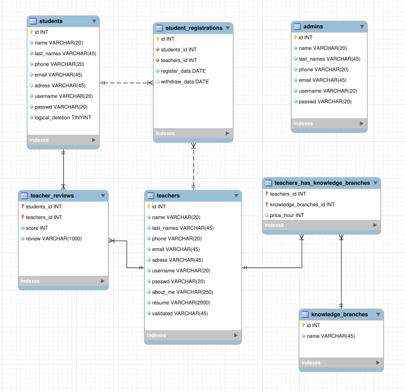

# Apuntes para la creación de la BD relacional.

## Notas:
- La base de datos ha sido diseñada directamente sobre MySql workbench.
- En algunos campos, no se si el tamaño de caracteres es adecuado. Opiniones?
- Al reproducir en vuestro ordenador, no os preocupeis por archivos *.bak que genera mysql workbenk, he añadido una regla en el fichero .gitinore....

## MySql Workbench

## Tabla **admins**
En la versión definitiva aquí se detallaran las tablas usadas.