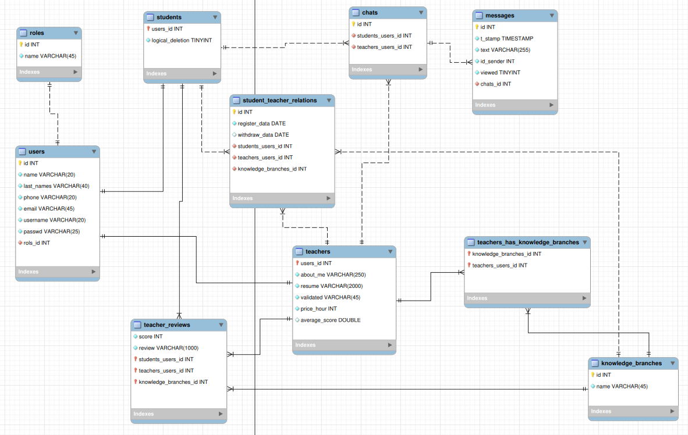

# Apuntes para la creación de la BD relacional.

## Notas:
- La base de datos ha sido diseñada directamente sobre MySql workbench.
- En algunos campos, no se si el tamaño de caracteres es adecuado. Aunque no es nuestro rol diseñar bases de datos quizas tengais una opinión, bienvenida es ...
- Al reproducir en vuestro ordenador, no os preocupeis por archivos *.bak que genera mysql workbenk, he añadido una regla en el fichero .gitinore....

## MySql Workbench


## Tablas
Aquí tienes un resumen de cada tabla de la base de datos teacherapp_db junto con una breve explicación de cada campo:

### Tabla roles
Almacena los diferentes roles (o perfiles) que pueden tener los usuarios (estudiantes, profesores, administradores o Jedis por niveles).
 
```
id (INT): Identificador único para cada rol.
name (VARCHAR(45)): Nombre del rol
``` 
### Tabla users
Almacena la información de los usuarios del sistema.
 ```
id (INT): Identificador único para cada usuario.
name (VARCHAR(20)): Nombre del usuario.
last_names (VARCHAR(40)): Apellidos del usuario.
phone (VARCHAR(20)): Número de teléfono del usuario.
email (VARCHAR(45)): Correo electrónico del usuario.
username (VARCHAR(20)): Nombre de usuario para acceder al sistema.
passwd (VARCHAR(25)): Contraseña del usuario.
rols_id (INT): Identificador del rol asociado al usuario (enlace con la tabla roles).
```

### Tabla students
 Almacena información adicional sobre los estudiantes, que de momento solo és `logical_deletion`, un campo para marcar si un estudiante ha sido eliminado de forma lógica (1 = eliminado, 0 = activo).
``` 
logical_deletion (TINYINT) : campo marcado eliminación_logica.
users_id (INT): Identificador del usuario que corresponde al estudiante (enlace con la tabla users).
```

### Tabla teachers
 Almacena información adicional sobre los profesores.
``` 
users_id (INT): Identificador del usuario que corresponde al profesor (enlace con la tabla users).
about_me (VARCHAR(250)): Descripción del profesor.
resume (VARCHAR(2000)): Resumen o CV del profesor.
validated (VARCHAR(45)): Estado de validación del profesor (si está validado o no).
price_hour (INT): Precio por hora que cobra el profesor.
average_square (DOUBLE): Promedio de la calificación del profesor.
```

### Tabla teacher_reviews
Almacena reseñas y puntuaciones que los estudiantes dejan para los profesores. `students_users_id` y `teachers_users_id` son claves primarias foraneas de manera que un alumno solo puede puntuar un profesor en una única reseña.
```
score (INT): Puntuación que se le da al profesor (de 1 a 5).
review (VARCHAR(1000)): Texto de la opinión sobre el profesor.
students_users_id (INT): Identificador del estudiante que deja la reseña (enlace con la tabla students).
teachers_users_id (INT): Identificador del profesor que recibe la reseña (enlace con la tabla teachers).
```

### Tabla knowledge_branches
Almacena las distintas áreas de conocimiento o ramas en las que los profesores pueden enseñar.
``` 
id (INT): Identificador único para cada área de conocimiento.
name (VARCHAR(45)): Nombre del área de conocimiento (por ejemplo, "Matemáticas", "Física").
```

### Tabla student_registrations
Almacena los registros de inscripción de estudiantes con profesores. Una fecha de inscripción y otra de baja dnos permite llevar un registro de todos los registros activos de la plataforma. Un alumno puede apuntarse con el mismo profesor el siguiente año. 
``` 
id (INT): Identificador único para cada registro.
register_data (DATE): Fecha de inscripción del estudiante.
withdraw_data (DATE): Fecha de retiro (opcional) del estudiante.
students_users_id (INT): Identificador del estudiante inscrito (enlace con la tabla students).
teachers_users_id (INT): Identificador del profesor con quien el estudiante está inscrito (enlace con la tabla teachers).
``` 
### Tabla teachers_has_knowledge_branches
Relaciona a los profesores con las áreas de conocimiento en las que están capacitados para enseñar.
``` 
knowledge_branches_id (INT): Identificador del área de conocimiento (enlace con la tabla knowledge_branches).
teachers_users_id (INT): Identificador del profesor (enlace con la tabla teachers).
```
### Tabla chats
Almacena las conversaciones (chats) entre estudiantes y profesores. Tenemos en cuenta que un alumno o profe puede tener abiertos más de un chat con la mismo profesor con diferente tematica que no quiere ser borrado. Aquí igual le falta un poco de trabajo. Por ejemplo, quien puede borrar el chat ? Quizas deberia haber unos campos boleanos `student_deletion`,  `teacher deletion` y cuando los dos sean 1 se borra definitivamente el chat. Ya me comentareis.
```
id (INT): Identificador único del chat.
students_users_id (INT): Identificador del estudiante  (enlace con la tabla students).
teachers_users_id (INT): Identificador del profesor  (enlace con la tabla teachers).
```

### Tabla messages
Almacena los mensajes enviados dentro de los chats. Se incluye una marca de tiempo de cuando se envió el mensaje, para después poder presentarlos cronologicamente en el "front end". Si el que envia el mensaje es la misma persona que lo visualiza, podria salir de un color diferente en el front.
``` 
id (INT): Identificador único del mensaje.
t_stamp (TIMESTAMP): Marca de tiempo 
text (VARCHAR(255)): Contenido del mensaje.
id_sender (INT): Identificador del usuario que envió el mensaje.
viewed (TINYINT): Indica si el mensaje ha sido visto (1 = visto, 0 = no visto).
chats_id (INT): Identificador del chat al que pertenece el mensaje (enlace con la tabla chats).
```